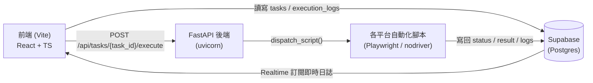

# 智慧預約與購票自動化系統 (RPA)

⚠️ **【免責與學術專題研究聲明】**

1. **本專案為【課程期末專題】之學術實驗與模擬專案，僅供學術研究、教育展示與技術學習用途。**
2. 專案主要研究「高併發環境下的自動化排程調度」以及「機器視覺 (OCR/CNN) 在輔助驗證碼辨識上之應用與防禦機制」。
3. **本專案僅開源原始碼進行技術交流，不提供任何已編譯好的可執行檔（如 .exe、.app 等安裝包），亦不提供任何商業服務。**
4. 所有測試皆應於本機模擬環境或獲得授權之測試平台進行。請勿將本專案程式碼用於任何違反當地法律（如台灣《文化創意產業發展法》）、繞過售票系統服務條款或破壞售票公平性之真實搶票行為。
5. 使用者若自行修改、部署或運行本專案於真實生產環境，因而產生的任何法律糾紛、損害賠償或相關衍生責任，**皆由使用者個人完全承擔**，開發團隊與指導教師不負任何連帶或連鎖法律責任。

---

## 目錄

- [專案簡介](#專案簡介)
- [支援的自動化類型](#支援的自動化類型)
- [系統架構](#系統架構)
- [技術棧](#技術棧)
- [專案結構](#專案結構)
- [環境需求](#環境需求)
- [安裝與啟動](#安裝與啟動)
  - [1. 取得原始碼](#1-取得原始碼)
  - [2. 後端設定](#2-後端設定)
  - [3. 前端設定](#3-前端設定)
  - [4. 同時啟動前後端](#4-同時啟動前後端)
- [Supabase 資料表結構](#supabase-資料表結構)
- [環境變數說明](#環境變數說明)
- [選用功能設定](#選用功能設定)
  - [LINE 通知](#line-通知)
  - [CapSolver 驗證碼辨識](#capsolver-驗證碼辨識)
  - [各平台登入憑證管理](#各平台登入憑證管理)
- [常見問題與已知限制](#常見問題與已知限制)

---

## 專案簡介

這是一套個人化的「排程 + 瀏覽器自動化」系統，把重複性高、需要盯著時間點手動搶快的預約/購票流程，改成由後端腳本自動執行，前端提供任務建立、優先序排程、即時日誌串流與執行結果通知。

系統設計上刻意讓前端與後端完全解耦——兩者只透過 Supabase 資料庫溝通（任務設定寫進 `config`、執行進度與結果寫進 `status`/`result`），前端不直接控制瀏覽器，後端腳本也不假設前端一定在線上。

## 支援的自動化類型

| 前端卡片 | 對應腳本 | 說明 |
|---|---|---|
| 🏥 醫院掛號 | `hospital_booking.py` | 支援台大醫院、長庚等院所掛號，含圖形驗證碼自動辨識（CapSolver） |
| 🎫 演唱會搶票 | `tixcraft_booking.py` | 拓元 (tixCraft) 售票自動化，使用 nodriver 繞過 Akamai Bot Manager 偵測，含拓元專用 OCR 模型 + Yii2 雜湊校驗驗證碼 |
| 🍽️ 美食預約 | `inline_booking.py` | inline.app 訂位系統，處理 PerimeterX 人機驗證與簡訊驗證碼（OTP）流程 |
| ✈️ 折扣機票 | `flight_scraper.py` | 定期爬取 Google Flights / Trip.com 票價，低於預算時透過 LINE 通知（僅通知，不自動下單） |
| 🏸 羽球場地預約 | `badminton_booking.py` | 羽球場地線上預約自動化 |
| 🚄 高鐵訂票 | `thsr_booking.py` | 台灣高鐵網路訂票自動化 |

## 系統架構

本專案採用前後端分離架構：

- **前端控制台**（React + Vite + TailwindCSS）：建立/管理自動化任務、設定預約偏好順位（首選 + 候補）、透過 Supabase Realtime 訂閱即時檢視執行日誌、OTP 驗證碼輸入視窗、LINE 通知設定。
- **後端自動化引擎**（Python + FastAPI）：接收任務請求、依優先序與排程時間調度執行、驅動瀏覽器自動化（Playwright / patchright / nodriver，依各平台的反爬蟲防護程度選用）、將執行過程即時寫回資料庫供前端輪詢/顯示。
- **Supabase**：作為前後端之間唯一的溝通媒介與任務持久化儲存（不是單純的資料庫，前端的即時狀態顯示、OTP 中繼、執行結果通知都靠它）。



## 技術棧

**前端**
- React 19 + TypeScript + Vite
- TailwindCSS v4
- Base UI（元件庫）
- TanStack Query（資料抓取/輪詢）
- Supabase JS SDK

**後端**
- FastAPI + uvicorn
- Supabase Python SDK
- APScheduler（排程任務輪詢）
- Playwright / patchright（反偵測 Playwright 分支）/ nodriver（CDP 底層瀏覽器控制，用於繞過 Akamai 等進階風控）
- ddddocr（驗證碼 OCR，支援載入專用 ONNX 模型）
- CapSolver（第三方圖形驗證碼辨識 API，選用）

## 專案結構

```
RPA/
├── backend/
│   ├── main.py                  # FastAPI 進入點、API 路由、排程器
│   ├── tasks_dispatcher.py      # Supabase 連線與 execution_logs 寫入
│   ├── requirements.txt
│   ├── .env                     # 環境變數（不納入版控）
│   ├── auth/                    # 各平台登入憑證存放處（不納入版控）
│   ├── models/                  # 拓元專用 OCR 模型檔，來自 tickets_hunter（不納入版控）
│   └── scripts/
│       ├── __init__.py          # SCRIPT_ROUTER：task_type -> 執行函式
│       ├── hospital_booking.py
│       ├── tixcraft_booking.py
│       ├── inline_booking.py
│       ├── flight_scraper.py
│       ├── badminton_booking.py
│       ├── booking_api.py       # 羽球訂場用的 HTTP API 逆向工程層（登入/驗證碼送出邏輯）
│       ├── thsr_booking.py
│       ├── setup_tixcraft_login.py / convert_cookies_to_storage_state.py
│       │   # 手動登入並匯出/轉換各平台會員憑證的輔助腳本
│       ├── setup_capsolver.py   # 安裝並設定 CapSolver 瀏覽器擴充功能的輔助腳本
│       └── dev_tools/           # 各平台除錯用的輔助腳本，見該目錄下的 README.md
└── frontend/
    └── src/
        ├── components/workflows/  # 任務建立表單、優先序設定、OTP 輸入視窗
        ├── components/common/     # 共用元件（Sidebar、Navbar、OTP 輸入視窗等）
        ├── hooks/                 # 各類型任務的表單/啟動邏輯
        └── apis/                  # 後端 API 呼叫封裝
```

## 環境需求

- **Node.js** 18 以上
- **Python** 3.10 以上（建議使用虛擬環境）
- **Google Chrome**（已安裝於系統上；部分腳本會優先呼叫真實 Chrome 而非 Playwright 內建的 Chromium，以降低被偵測為自動化工具的機率）
- **Supabase 專案**（免費方案即可）

## 安裝與啟動

### 1. 取得原始碼

```bash
git clone <this-repo-url>
cd RPA
```

### 2. 後端設定

```bash
cd backend
python -m venv venv
venv\Scripts\activate        # Windows
# source venv/bin/activate   # macOS/Linux

pip install -r requirements.txt
playwright install chromium  # 安裝 Playwright 所需瀏覽器驅動
```

在 `backend/` 目錄下建立 `.env` 檔案（參考下方[環境變數說明](#環境變數說明)）。

啟動後端：

```bash
uvicorn main:app --reload --port 8000
```

### 3. 前端設定

```bash
cd frontend
npm install
npm run dev
```

預設會在 `http://localhost:5173` 啟動，並連線至 `http://localhost:8000` 的後端 API。

### 4. 同時啟動前後端

開兩個終端機視窗，分別在 `backend/` 與 `frontend/` 目錄下執行上述啟動指令即可。

## Supabase 資料表結構

需要在 Supabase 專案裡建立一張 `tasks` 資料表，至少包含以下欄位：

| 欄位 | 型別 | 說明 |
|---|---|---|
| `id` | `uuid` | 主鍵 |
| `task_type` | `varchar` | 對應 `scripts/__init__.py` 的 `SCRIPT_ROUTER` key（如 `hospital_booking`、`tixcraft_booking`） |
| `status` | `varchar` | `pending` / `queued` / `running` / `waiting_otp` / `success` / `failed` |
| `created_at` | `timestamptz` | 建立時間 |
| `config` | `jsonb` | 該任務的參數設定（分店、日期、時段、聯絡資訊、優先度 `priority`、排程觸發時間 `scheduled_at` 等） |
| `result` | `jsonb` | 執行結果（截圖路徑、錯誤訊息、成功時的訂位/搶票細節） |
| `otp_code` | `text` | 使用者透過前端輸入的簡訊驗證碼，供需要 OTP 的腳本（如 `inline_booking.py`）讀取 |

> `priority`（優先度）與 `scheduled_at`（排程觸發時間，機器人幾點該開始執行——不是訂位/訂票的目標日期）刻意不建成獨立欄位，而是統一存在 `config` 裡。`main.py` 的 `create_task`/`update_task` 都只往 `config` 寫，讀取時（排程器巡邏、前端顯示）也一律以 `config` 為準；若之後真的要拆成獨立欄位，`update_task` 的讀取-合併-寫回邏輯需要一併調整，否則會重新出現「編輯任務時新舊值對不上」的問題。

另外還需要一張 `execution_logs` 資料表，供 `tasks_dispatcher.log_execution()` 寫入即時執行日誌（前端透過 Supabase Realtime 訂閱這張表，即時顯示在 log 面板）：

| 欄位 | 型別 | 說明 |
|---|---|---|
| `id` | `uuid` / `int8` | 主鍵 |
| `task_id` | `uuid` | 對應 `tasks.id` |
| `level` | `varchar` | 日誌等級（`start` / `action` / `error` / `success` 等） |
| `message` | `text` | 日誌內容 |
| `created_at` | `timestamptz` | 建立時間 |

> `result` 與 `otp_code` 欄位並非所有腳本都會用到，但只要有任何一支自動化腳本啟用 OTP 流程或需要記錄詳細執行結果，就必須先建好這兩個欄位，否則對應功能會靜默失效或前端狀態查詢 API 會回傳錯誤。

## 環境變數說明

`backend/.env` 需要設定以下變數：

```env
# Supabase 連線資訊
SUPABASE_URL=https://xxxxxxxx.supabase.co
SUPABASE_KEY=your-supabase-anon-or-service-key

# CapSolver（選用，供醫院掛號等平台的圖形驗證碼辨識使用）
CAPSOLVER_API_KEY=your-capsolver-api-key

# LINE Messaging API（選用，供任務完成通知使用）
LINE_CHANNEL_ACCESS_TOKEN=your-line-channel-access-token
LINE_USER_ID=your-line-user-id
```

## 選用功能設定

### LINE 通知

在前端「設定」頁面可以開關「任務成功」「任務失敗」是否要發送 LINE 通知（對應 `backend/line_config.json` 的 `triggers` 設定）。需要先在 LINE Developers 建立一個 Messaging API 頻道，取得 Channel Access Token 與你自己的 User ID，填入 `.env`。

### CapSolver 驗證碼辨識

醫院掛號等平台使用的是傳統圖形驗證碼，可以透過 [CapSolver](https://www.capsolver.com/) 這類第三方付費 API 自動辨識。若不設定 `CAPSOLVER_API_KEY`，腳本會跳過自動辨識、改為提示使用者手動輸入。

拓元搶票 (`tixcraft_booking.py`) 則是使用另一套機制：優先載入 `backend/models/` 底下針對拓元驗證碼樣式的專用 ONNX 模型（`custom.onnx` + `charsets.json`）進行辨識，並用拓元 Yii2 框架本身提供的驗證碼雜湊值在送出前先自我校驗，找不到專用模型時才會退回通用 ddddocr 模型。這個模型並非自行訓練——曾嘗試用約 2000 張圖片訓練，成功率僅 16%，改採用開源專案 [tickets_hunter](https://github.com/bouob/tickets_hunter) 提供的現成模型。這兩個模型檔案不納入版控，需自行放置。

### 各平台登入憑證管理

部分平台（如拓元）需要先登入會員帳號才能訂票。`backend/scripts/setup_tixcraft_login.py` 會開啟一個瀏覽器視窗讓你手動登入，登入完成後將 Cookie 匯出成 `backend/auth/tixcraft_state.json`，之後執行自動化任務時會自動載入這份憑證以維持登入狀態。

也可以改用瀏覽器的 Cookie-Editor 之類擴充功能手動匯出 Cookie，再用 `backend/scripts/convert_cookies_to_storage_state.py` 轉換成腳本所需的格式。

詳見 `backend/auth/README.md`。

> ⚠️ `backend/auth/` 與 `backend/models/` 底下的檔案都是真實登入憑證或第三方模型檔，已在 `.gitignore` 中排除，請勿手動加入版控。

## 常見問題與已知限制

- **部分售票/訂位平台有嚴格的反機器人防護**（如拓元的 Akamai Bot Manager、inline.app 的 PerimeterX），這也是本專案採用 nodriver / patchright 等進階瀏覽器控制方案，而非單純 Playwright 的原因。即便如此，這些平台的防護策略會持續更新，程式碼中的偵測與繞過邏輯不保證長期有效。
- **各平台網頁結構若有更動**（改版、A/B 測試等），對應腳本的 CSS 選擇器/`data-cy` 定位邏輯可能需要重新調整。
- **驗證碼與簡訊 OTP 流程仍需要人工介入的環節**：多數售票/訂位平台基於安全考量，最終送出前一定會有需要人類判斷或接收簡訊的關卡，本專案的自動化目標是「減少人工介入到最後一哩路」，而非完全去除人工確認。
